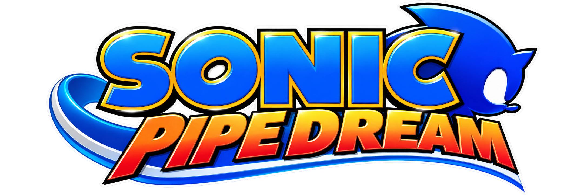
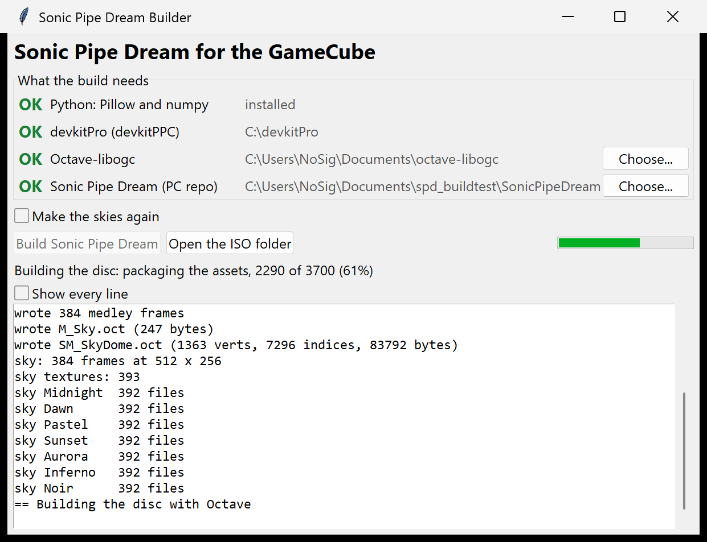

# Sonic Pipe Dream (GameCube)

**A modern take on Sonic 2's iconic half-pipe special stages, in full 3D for the Nintendo GameCube.**

> **In active development.** Sonic Pipe Dream is a work in progress: stages, controls and the way
> it plays may change from one build to the next, and some features are not there yet.
>
> Found a bug? Please report it as a ticket on the
> [Issues page](https://github.com/myuu-151/SonicPipeDream-GC/issues): what happened, what you expected,
> and how to make it happen again if you can.

The GameCube version of [Sonic Pipe Dream](https://github.com/myuu-151/SonicPipeDream).

## Controls

| | Menus | Stage |
|---|---|---|
| Stick or d-pad | Move the highlight | Steer round the pipe |
| A | Choose | Jump; again in the air to drop dash; hold through a landing to bounce highest |
| L (hold) | | Spin dash: skid to a stop, press A to rev, let go of L to blast off |
| B | Back | |
| Start | Choose | Pause: Continue or Exit |

## Playing it

Download the disc image from [Releases](https://github.com/myuu-151/SonicPipeDream-GC/releases)
(or build it as described in [docs/gamecube-build.md](docs/gamecube-build.md)), then run it in
Dolphin or on a GameCube that can load disc images. On a real GameCube it is played from an SD
card (the image on the card, loaded through Swiss); an SD adapter that supports DMA reads it
fastest.

**In Dolphin**, set two things in the game's properties:
- **Untick Emulate Disc Speed** (`[Core] FastDiscSpeed = True`). The game streams its sky and
  music from the disc all the time, and at emulated drive speed that slows it down.
- **Use DSP LLE** (`[Core] DSPHLE = False`). With DSP HLE the game freezes about 25 seconds in;
  the details are in the build notes.

## Building it yourself

The whole disc image builds from this repo and the PC one.

You need:
- **This repo and [the PC repo](https://github.com/myuu-151/SonicPipeDream)**, cloned side by
  side (the builder lets you choose the PC one if it's elsewhere).
- **[Octave-libogc](https://github.com/myuu-151/Octave-libogc)**, the v2.2 release or newer, with
  its GameCube engine library built (`Engine/Build/GCN/libEngine.a`).
- **[devkitPro](https://devkitpro.org)** with devkitPPC, or [gekko-toolchain](https://github.com/myuu-151/gekko-toolchain) (the same toolchain in one
  zip). With both, the builder's **GameCube toolchain** switch picks one.
- **Python 3** with Pillow and numpy: `py -m pip install pillow numpy`.

Double-click **`Build Sonic Pipe Dream.bat`**. The builder window checks each of those and says
how to fix anything missing. One button then makes what isn't in git from the PC repo (the sky's
384 frames, from its sky generator, and the seven other skies), packages the disc with Octave and
gives it its name. Each step shows how far it is; nothing opens a window of its own. The first
build takes about four minutes, later ones about two and a half. The disc image is
`proj/Packaged/GameCube/SonicPipeDream.iso`.

## More

- [docs/gamecube-build.md](docs/gamecube-build.md): how the port is made from the PC repo, and how to build it.
- [docs/gamecube-fixes.md](docs/gamecube-fixes.md): everything that had to change to run in 24 MB, and why, and what took it from 28 to 55-60 frames a second on hardware.
- [docs/gamecube-memory.md](docs/gamecube-memory.md): what fills memory in a run, the difficulty-7 fragmentation hunt, and what bigger GameCube games do differently.

## Credits

- **Music**: Falk
- **Sonic model**: murissargb
- **Lives icon**: eris1521987

Built on the [Octave engine](https://github.com/myuu-151/Octave-libogc).

*A fan game, not affiliated with SEGA. Sonic the Hedgehog is a trademark of SEGA.*
